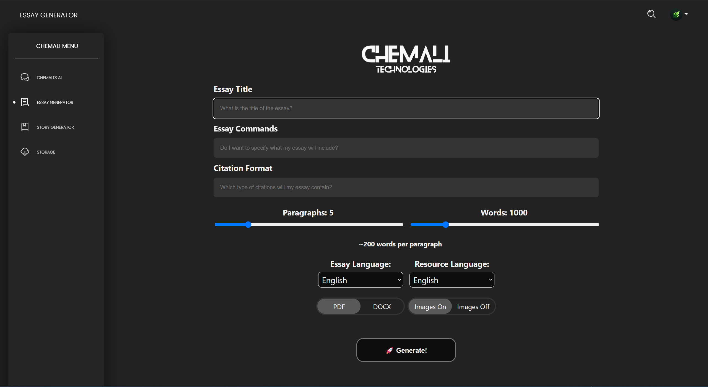
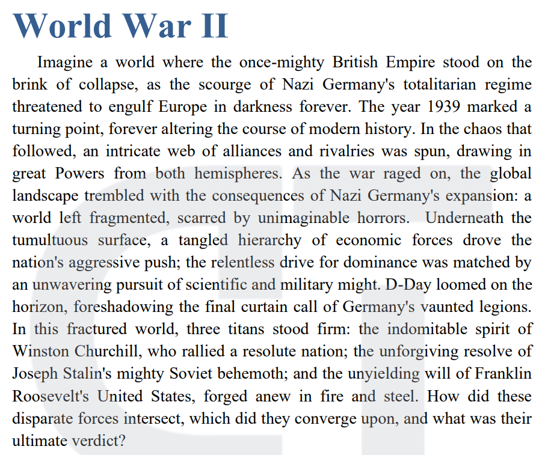

# Content Generator

---
A Content Generator that utilizes an LLM and internet scraping to dynamically generate well-structured documents of varying lengths, rich in information and traditionally partitioned.

An online publicly available version of this Essay Generated is Available on my Website [chemali.de](https://chemali.de), it's easier to use for people who are not able to code.




Here is the Introduction from the [Sample Essay Provided](Generation%20Sample.pdf):



This Introduction was Generated by the [Llama3.2 3B Model](https://huggingface.co/meta-llama/Llama-3.2-3B), using the ContentGenerator as a framework.

This Generator was created for Educational and Scientific Purposes, and by no means should be used with intentions of Cheating or as a Professional Tool.

Keep in mind that if this Generator was running on external, paid-per-token based models, a pretty penny will have to be spent in order to obtain proper results... Especially if the requested Content is of Large Size.

The ContentGenerator was tested using a locally hosted [Meta Llama3.2 3B](https://huggingface.co/meta-llama/Llama-3.2-3B) Model with [ollama](https://github.com/ollama/ollama). Note that your mileage may vary when using a different **Large Language Model**.

The ContentGenerator is not fully complete yet, as it only has an Essay Generator Available. Do expect a *Story Generator* to come out any time soon.

---

# How to use the Content Generator
Let's start with the Essay Section, we import the class that manages Essays.
```
from ContentGenerators.Essay import Document
```
The Essay itself has multiple parameters that determine the size of the document and the information that it contains.
The Essay Class already comes with pre-set values to avoid possible crashes due to human error.
```
# These default values result in the Generation of a Generic Essay That talks about "The Evolution of Artificial Intelligence".
def __init__(self,
    id=None,
    path=".", #
    topic="The Evolution of Artificial Intelligence.",
    commands="",
    paragraphs=5,
    wordcount=1000,
    pictures=False,
    language="en",
    search_language="en",
    citation_format="MLA"
    ):
    ...
```

In order to use the Essay Generator and receive a Human-readable Essay, we can use this code right here:

```
from ContentGenerators.Essay import Document

Essay = Document(pictures=True, topic="World War II")
Essay.Generate()
Essay.Assemble(watermark=True)

```

The `Essay.Assemble()` Function simply packages all the Information such as Paragraphs, citations, and pictures generated using the `Essay.Generate()` Function, inside a Final Document, that document can either be a DOCX or PDF file. After all the functions have been executed successfully, the document should appear in your `./` path as `essay_XXXXXXXXXX.(docx/pdf)`. From there you can access the final result Generated.

Keep in mind that you need [Microsoft Office](https://www.microsoft.com/en-us/microsoft-365/microsoft-office) or [LibreOffice](https://www.libreoffice.org/) installed on your device depending on your Operating System, thats ONLY if you are trying to convert your document to a pdf.
You do NOT need any type of Document management software/suit for just generating a DOCX file as that is handled inside the imported python library.

Speaking of python libraries, make sure you install all of the required packages using the [requirements.txt](requirements.txt) file provided.

```
pip install -r requirements.txt
```


Expect More Optimisations, New Updates, and Generation Features in the future!
