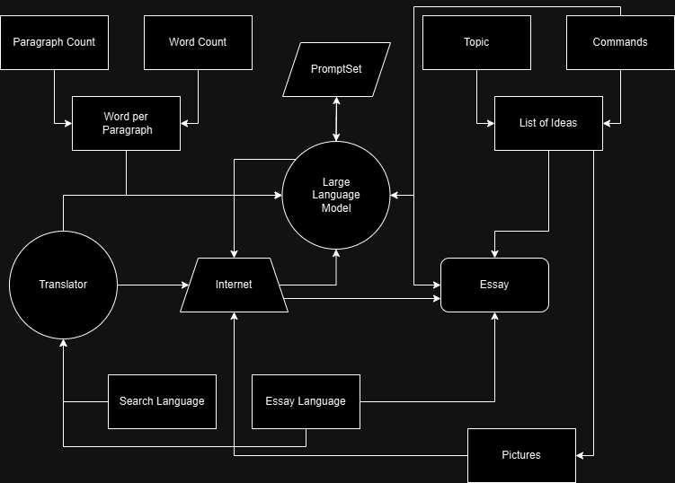

# Content Generator


A Content Generator that utilizes an LLM and internet scraping to dynamically generate well-structured documents of varying lengths, rich in information and traditionally partitioned.

A publicly available version of this Essay Generator is Available online on my Website [chemali.de](https://chemali.de), it's easier to use for people who are not able to code. Keep in mind that the Server might crash if its facing lots of traffic/generation requests, so never depend on it for any serious Generation purposes.


---

Here is the Introduction from the [Sample Essay Provided](Generation%20Sample.pdf):


This Introduction was Generated by the [Llama3.2 3B Model](https://huggingface.co/meta-llama/Llama-3.2-3B), using the ContentGenerator as a framework.

This Generator was created for Educational and Scientific Purposes, and by no means should be used with intentions of Cheating or as a Professional Tool.

Keep in mind that if this Generator was running on external, paid-per-token based models, a pretty penny will have to be spent in order to obtain proper results... Especially if the requested Content is of Large Size.

The ContentGenerator was tested using a locally hosted [Meta Llama3.2 3B](https://huggingface.co/meta-llama/Llama-3.2-3B) Model with [ollama](https://github.com/ollama/ollama). Note that your mileage may vary when using a different **Large Language Model**.

The ContentGenerator is not fully complete yet, as it only has an Essay Generator Available. Do expect a *Story Generator* to come out any time soon.

---

# How to use the Content Generator
Let's start with the Essay Section, we import the class that manages Essays.
```python
from ContentGenerators.Essay import Document
```
The Essay itself has multiple parameters that determine the size of the document and the information that it contains.
The Essay Class already comes with pre-set values to avoid possible crashes due to human error.
```python
# These default values result in the Generation of a Generic Essay That talks about "The Evolution of Artificial Intelligence".
def __init__(self,
    id=None,
    path=".", #
    topic="The Evolution of Artificial Intelligence.",
    commands="",
    paragraphs=5,
    wordcount=1000,
    pictures=False,
    language="en",
    search_language="en",
    citation_format="MLA"
    ):
    ...
```

In order to use the Essay Generator and receive a Human-readable Essay, we can use this code right here:

```python
from ContentGenerators.Essay import Document

Essay = Document(pictures=True, topic="World War II")
Essay.Generate()
Essay.Assemble(watermark=True)

```

The `Essay.Assemble()` Function simply packages all the Information such as Paragraphs, citations, and pictures generated using the `Essay.Generate()` Function, inside a Final Document, that document can either be a DOCX or PDF file. After all the functions have been executed successfully, the document should appear in your `./` path as `essay_XXXXXXXXXX.(docx/pdf)`. From there you can access the final result Generated.

Keep in mind that you need [Microsoft Office](https://www.microsoft.com/en-us/microsoft-365/microsoft-office) or [LibreOffice](https://www.libreoffice.org/) installed on your device depending on your Operating System, thats ONLY if you are trying to convert your document to a pdf.
You do NOT need any type of Document management software/suit for just generating a DOCX file as that is handled inside the imported python library.

Speaking of python libraries, make sure you install all of the required packages using the [requirements.txt](requirements.txt) file provided.

```
pip install -r requirements.txt
```


Expect More Optimisations, New Updates, and Generation Features in the future!

---

# How Does the Essay Generator Work?

As we saw in the previous section, the essay generator is composed of 2 significant pieces, the *Content Generator* and the *Content Assembler*.

Let's start with the Content Generator, these are the main parameters of the Essay Generator function along with their default values:

```python
id=None,
path=".", #
topic="The Evolution of Artificial Intelligence.",
commands="",
paragraphs=5,
wordcount=1000,
pictures=False,
language="en",
search_language="en",
citation_format="MLA"
```
## 1: id (String)
This parameter was originally created for handling a load of essays and storing them in a database, basically preserve uniqueness in essay filenames in order to easily server them to the userbase.

The value of this parameter can be as simple as a random string:
```python
Essay = Document(id="JSH3UI43H29RIJS83")
```
## 2: path (String)
This parameter is just for setting where the final product, the essay, will be stored. Its originally set to `"."` which means that the essay will be generated in the same directory the project exists in.

If you want to place the document in a separate folder in your project, you can easily do so by just specifying in the parameter:
```python
Essay = Document(path="my_folder")
```

## 3: topic (String)
This is the most important parameter in the Generate Function as it determines what the requested Essay will be talking about, it's used to generate ideas, pictures, and most importantly paragraphs.

The value of this parameter can be set this way:
```python
Essay = Document(topic="The Cold War.")
```

## 4: commands (String)
This parameter can be used to alter the information that the LLM Generator, examples of usage can include bias as in siding with a specific side of a conflict, focusing more on one side of a topic rather than broadly indulging in it, or using a specific way of writing/language.

You can tell the LLM what to do like this:
```python
Essay = Document(commands="Side with the Soviet Union on this one, and describe how their ideology is right. Use extremely Complicated and Detailed Language.")
```
or (for neutrality's sake):

```python
Essay = Document(commands="Side with the Americans on this one, and describe how their ideology is right. Use extremely simple and broad Language.")
```

## 5: paragraphs (Integer)
This parameter determines the overall size of the essay itself, the word count is heavily dependent on the amount of paragraphs due to the reset of token generation in between each paragraph, which is very handy when using an online model because of stricter generation limits.

Let's say we need 8 paragraphs in this Essay:
```python
Essay = Document(paragraphs=8)
```

## 6: wordcount (Integer)
This parameters determines the size of each paragraph in the essay using a words-per-paragraph equation, which basically determines how many words each paragraph will contain.
```python
words_per_paragraph = word_count / paragraph_count
# The value of this variable is then fed into the paragraph generating prompt.
```

Let's say we will need a 2000-word essay:
```python
Essay = Document(wordcount=2000)
```

## 7: pictures (Boolean)
This parameter just determines whether the essay will contain pictures or not.

Let's say we do want pictures in this essay:
```python
Essay = Document(pictures=True)
```

## 8: language (String)
This parameter decides what language the essay will be written in.

Here is a list of all the language you can generate your Essay in:
```
English - en      Afrikaans - af    Albanian - sq    Amharic - am     Arabic - ar      Armenian - hy  
Assamese - as     Aymara - ay       Azerbaijani - az Bambara - bm     Basque - eu      Belarusian - be  
Bengali - bn      Bhojpuri - bho    Bosnian - bs     Bulgarian - bg   Catalan - ca     Cebuano - ceb  
Chichewa - ny     Chinese - zh-CN   Corsican - co    Croatian - hr    Czech - cs       Danish - da  
Dhivehi - dv      Dogri - doi       Dutch - nl       Esperanto - eo   Estonian - et    Ewe - ee  
Filipino - tl     Finnish - fi      French - fr      Frisian - fy     Galician - gl    Georgian - ka  
German - de       Greek - el        Guarani - gn     Gujarati - gu    Haitian - ht     Hausa - ha  
Hawaiian - haw    Hebrew - iw       Hindi - hi       Hmong - hmn      Hungarian - hu   Icelandic - is  
Igbo - ig         Ilocano - ilo     Indonesian - id  Irish - ga       Italian - it     Japanese - ja  
Javanese - jw     Kannada - kn      Kazakh - kk      Khmer - km       Kinyarwanda - rw Konkani - gom  
Korean - ko       Krio - kri        Kurdish (K) - ku Kurdish (S) - ckb Kyrgyz - ky     Lao - lo  
Latin - la        Latvian - lv      Lingala - ln     Lithuanian - lt  Luganda - lg     Luxembourgish - lb  
Macedonian - mk   Maithili - mai    Malagasy - mg    Malay - ms       Malayalam - ml   Maltese - mt  
Maori - mi        Marathi - mr      Meiteilon - mni-Mtei Mizo - lus    Mongolian - mn  Burmese - my  
Nepali - ne       Norwegian - no    Odia - or        Oromo - om       Pashto - ps      Persian - fa  
Polish - pl       Portuguese - pt   Punjabi - pa     Quechua - qu     Romanian - ro    Russian - ru  
Samoan - sm       Sanskrit - sa     Scots Gaelic - gd Sepedi - nso    Serbian - sr     Sesotho - st  
Shona - sn        Sindhi - sd       Sinhala - si     Slovak - sk      Slovenian - sl   Somali - so  
Spanish - es      Sundanese - su    Swahili - sw     Swedish - sv     Tajik - tg       Tamil - ta  
Tatar - tt        Telugu - te       Thai - th        Tigrinya - ti    Tsonga - ts      Turkish - tr  
Turkmen - tk      Twi - ak          Ukrainian - uk   Urdu - ur        Uyghur - ug      Uzbek - uz  
Vietnamese - vi   Welsh - cy        Xhosa - xh       Yiddish - yi     Yoruba - yo      Zulu - zu  
```
Let's just Generate the Essay in English:

```python
Essay = Document(language="en")
```

## 9: search_language (String)
This parameter determines what language will be used in the search for information process (internet scraping).
It's quite important for region specific topics that might only be available in a specific language.

Since we are talking about The Cold War which is widely covered in the english language, lets just stick to english:
```python
Essay = Document(search_language="en")
```

## 10: citation_format (string)
This parameter just dictates the format of citations inserted at the end of the essay, quite important for organisation with specific research requirements.
Here are examples of Citation Formats:
+ APA Citation:
```
Grady, J. S., Her, M., Moreno, G., Perez, C., & Yelinek, J. (2019). Emotions in storybooks: A comparison of storybooks that represent ethnic and racial groups in the United States. Psychology of Popular Media Culture, 8(3), 207–217. https://doi.org/10.1037/ppm0000185
```
+ MLA Citation:
```
Del Castillo, Inigo. "How Not to Kill Your Houseplants, According to Botanists." Apartment Therapy, 29 Jan. 2020, www.apartmenttherapy.com/houseplant-tips-botanists-36710191.
```
+ Chicago Style:
```
Kossinets, Gueorgi, and Duncan J. Watts. 2009. “Origins of Homophily in an Evolving Social Network.” American Journal of Sociology 115:405–50. Accessed February 28, 2010. doi:10.1086/599247.
```
+ IEEE
```
[6] A. Altun, “Understanding hypertext in the context of reading on the web: Language learners’ experience,” Current Issues in Education, vol. 6, no. 12, July, 2005. [Online serial]. Available: http://cie.ed.asu.edu/volume6/number12/. [Accessed Dec. 2, 2007].
```
Expect 80% - 90% Accuracy with the Content Generator's Citations.

Let's just use APA Format for this Essay:
```python
Essay = Document(citation_format="APA")
```

### We are done with explaining the parameters, now let's generate an essay with the examples provided.
Here is the Script to Generate the Essay Using the Examples Above.
```python
from ContentGenerators.Essay import Document

Essay = Document(
    id="JSH3UI43H29RIJS83",
    path="readmeAssets",
    topic="The Cold War.",
    commands="Side with the Americans on this one, and describe how their ideology is right. Use extremely simple and broad Language.",
    paragraphs=8,
    wordcount=2000,
    pictures=True,
    language="en",
    search_language="en",
    citation_format="APA"
)

Essay.Generate()
Essay.Assemble(watermark=True)
```
Give it a try and let me know how it goes!

---

# Here's a Diagram Explaining how the Essay Generator works:



## Here is one of the First Prototypes Generated by chemali.de:
https://cloud.chemali.de/share/b2db903aac50fafbd355db38dc8e62f6716b39327e15010a704660e8bdce0090
